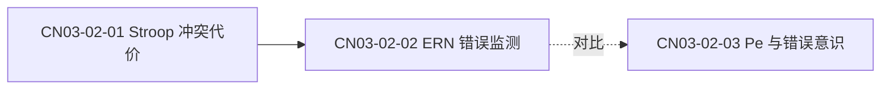

# 阶段细则

按需读取：执行到哪一阶段就读哪一节。所有产物落盘，中断后从 `COURSE.md` 恢复。

## 阶段 0 · 盘点

先确认四件事，缺哪件就问哪件：

- 课程名与学科方向（决定是否套用 `cogneuro-errors.md`）
- 录音文件（mp3/m4a/wav/mp4，或已有的转写稿）
- 课件（pptx/pdf，或已导出的图片）
- 本次要做到哪一步（只要笔记？还是要到题库？）

然后建工作区：

```bash
python scripts/init_course.py "<课程目录>" --name "<课程名>"
```

台账 `COURSE.md` 记录输入清单、各阶段状态、待老师确认项、下次继续的位置。

## 阶段 1 · 课件轨

1. PPTX：用 `presentations` 插件逐页提文本与备注。
2. PDF：用 `pdf` 插件提文本；扫描版走 `ocr-document-processor`。
3. 关键页渲染 PNG：公式、脑区示意图、流程图、表格、实验设计图。150–200 DPI 足够。
4. 产物：`02_slides/page-NN.txt`、`02_slides/page-NN.png`、`02_slides/slides.md`（合并稿，页间用 `<!-- page N -->` 分隔）。

判定：贴图页若文本层为空且是扫描件，必须过 OCR，不能凭图猜文字。

## 阶段 2 · 录音轨

1. 有 `OPENAI_API_KEY` 时用 `transcribe` skill 的 `scripts/transcribe_diarize.py`：
   - 只要文本：`gpt-4o-mini-transcribe` 配 `--response-format text`
   - 要区分师生：`gpt-4o-transcribe-diarize` 配 `--response-format diarized_json`
   - 超过约 30 秒保留 `--chunking-strategy auto`
2. 无 key 时，请用户提供现有转写稿，或走 `transcription-automation` 的替代路径。**不要假装转写已完成。**
3. 长音频先分片（按 20–30 分钟或按讲课自然段落），每片单独存，最后合并，避免中途失败重跑全部。
4. 产物：`01_transcript/transcript.txt`（带 `[mm:ss]` 时间戳），启用分离时加 `transcript.diarized.json`。

**时间戳是这条流水线的生命线**，丢了对齐就只能退化成语义猜测。

## 阶段 3 · 对齐

把讲述切到页：

1. 有真实翻页时间点就直接用。
2. 没有时按证据推断：老师念标题、说「下一页」「这张图」、讲述主题突变。
3. 逐页组装 `03_align/align.md`：

```markdown
## p.14 主题：BOLD 信号的生理基础
- 时间：12:30–16:05
- 课件文本：...
- 讲述要点：...
- 置信度：高 / 中（依据：老师明确说「看下一页」）/ 低（依据不足，待核）
```

对不上的片段放进 `03_align/unmatched.md`，不要硬塞进某一页。

## 阶段 4 · 纠错

逐条记录，不修改原文。分类：

| 类 | 含义 | 例 |
|---|---|---|
| A | ASR 误识别 | 术语、缩写、英文人名、脑区、统计量 |
| B | 数字与单位 | 被试数、阈值、时间窗、坐标 |
| C | 口误或前后矛盾 | 同一次课里自相矛盾的表述 |
| D | 课件与讲述冲突 | PPT 写 A、老师讲 B |

每条给五项：原文、位置（页或时间）、疑似正确、依据、置信度。

**低置信一律标「待老师确认」**，不要替老师下结论。产物：`04_corrections/corrections.md`。

## 阶段 5 · 学科补充

只补这三类（满足其一即可）：

- 课件一带而过，但属于本课考纲范围
- 录音里明显讲错或讲漏，不补会形成错误理解
- 是理解本课后续内容的前置概念

每条补充必须带出处与层级：教科书（书名 + 章节）、综述（作者 + 年份 + 期刊或 DOI）、权威数据库链接。用 `browser` 插件查证，**不要把模型记忆当成出处**。

产物：`05_supplements/supplements.md`，每条挂到对应知识点 ID。

## 阶段 6 · 知识大纲

三级结构，ID 稳定、不随重排改变：

```
CN03 注意与执行控制
  CN03-02 冲突监测
    CN03-02-01  Stroop 任务与冲突代价   [理解]  来源：PPT p.22 + 录音 38:10
    CN03-02-02  ERN 与错误监测          [应用]  来源：PPT p.25 + 录音 44:02 + 补充
```

每个条目记录：ID、名称、核心定义、关键词、掌握层级（了解/理解/应用）、来源、是否含补充。

同时输出 `06_outline/outline.json`，作为出题与统计的机器可读源：

```json
{
  "course": "认知神经科学",
  "units": [
    {
      "id": "CN03",
      "title": "注意与执行控制",
      "sections": [
        {
          "id": "CN03-02",
          "title": "冲突监测",
          "points": [
            {
              "id": "CN03-02-01",
              "title": "Stroop 任务与冲突代价",
              "definition": "不一致条件与一致条件的反应时之差",
              "keywords": ["Stroop", "冲突代价", "反应时"],
              "level": "理解",
              "sources": ["PPT p.22", "录音 38:10"],
              "hasSupplement": true
            }
          ]
        }
      ]
    }
  ]
}
```

**产出后停下，交给用户选范围。** 范围语法按集合运算理解：

- `CN03` 整个单元
- `CN03-02` 单节
- `CN03-02-01, CN03-02-03` 指定知识点
- `CN03 全部 + CN05-02 - CN03-02-02` 并集减差集

## 阶段 7 · 出题

规则见 [quiz-design.md](quiz-design.md)。流程：

1. 解析范围得到知识点 ID 列表
2. 读 `09_quiz/bank.json`，排除已出过的题与已用尽的角度
3. 按范围大小与用户要求分配题量与难度
4. 生成题目，写 `09_quiz/quiz-<范围>-<YYYYMMDD>.md`，练习模式下答案另存 `answers-<范围>-<YYYYMMDD>.md`
5. 追加进 `bank.json`

## 阶段 8 · 图谱与流程

**知识图谱**：Mermaid，节点用知识点 ID，边标注关系类型（包含 / 前置 / 对比 / 因果 / 并列）。



**讲课流程**：按时间还原讲者顺序、每段主题、转折点、举例、留的思考题。这是「老师怎么讲的」，与笔记「知识怎么组织」是两件事，分文件写。产物：`07_notes/lecture-flow.md`。

## 阶段 9 · 笔记与总结

- `07_notes/notes.md` — 图文并茂，关键图内嵌（``），每个小节挂知识点 ID 锚点，公式用 LaTeX。
- `07_notes/outline-detailed.md` — 详实知识点大纲 + 补充内容。
- `07_notes/summary.md` — 一页速览。
- 需要打印或分享时用 `documents` 插件渲染 Word/PDF。

## 阶段 10 · 复训与维护

```bash
python scripts/bank.py stats 09_quiz/bank.json
python scripts/bank.py pick 09_quiz/bank.json --tag CN03-02 --n 10
python scripts/bank.py dupes 09_quiz/bank.json
python scripts/bank.py record 09_quiz/bank.json --id Q001 --wrong
```

- 「把上次错的再出一遍」→ 按 `wrongCount` 或用户给的错题 ID 抽题
- 「第 4 章题量不够」→ 看 `stats` 里各知识点的题量，对着薄弱的补
- 每次出题后在 `COURSE.md` 记录范围、题量、文件路径

## 质量门

任务结束前逐条自检，任一不过就修：

1. 每个知识点有唯一 ID，且能指回 PPT 页或录音时间
2. 纠错项都有依据；低置信项都标了「待老师确认」
3. 补充内容都带出处，且与课堂原话分开
4. 每道题都有答案、解析、知识点 ID、来源
5. 题干不含答案线索，干扰项不是明显荒谬项
6. 与 `bank.json` 比对后确认为新题或新角度
7. 超纲题已标「拓展」
